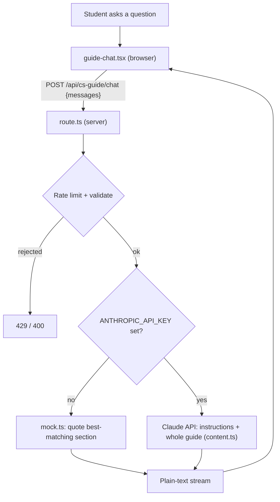

can # CS Guide chat

A floating **Ask the guide** panel on [`/cs-guide`](<../app/(public)/cs-guide/page.tsx>) that answers student questions from the guide's own content and links the section it used.

It runs in two modes:

- **Demo** (no API key): quotes the closest guide section. Free, so the UI can be reviewed and the page keeps working without a key.
- **Live** (`ANTHROPIC_API_KEY` set): Claude writes a short answer from the guide.

The header badge shows which mode answered.

## How a question flows



## Files

| File                                                                          | Role                                                          |
| ----------------------------------------------------------------------------- | ------------------------------------------------------------- |
| [`components/cs-guide/guide-chat.tsx`](../components/cs-guide/guide-chat.tsx) | The widget: button, panel, messages, streaming, link handling |
| [`app/api/cs-guide/chat/route.ts`](../app/api/cs-guide/chat/route.ts)         | Server route: rate limit, validation, Claude call, cost log   |
| [`lib/cs-guide/content.ts`](../lib/cs-guide/content.ts)                       | The guide as plain text, one entry per page anchor            |
| [`lib/cs-guide/mock.ts`](../lib/cs-guide/mock.ts)                             | Demo mode: keyword match against the guide sections           |

The page itself only gains an import and `<GuideChat />`.

### `content.ts`: what the bot knows

- The guide's prose as plain text, one entry per section, each with its anchor id (`#context-credits`, `#double-major`, …).
- Tables are not copied: they are rendered from the same `data/*.json` files the page uses, so they cannot drift.
- Everything is joined into `GUIDE_TEXT`, sent with every question. The guide is small (about 7 KB, ~1,800 tokens), so there is no search or vector database: Claude reads the whole guide each time.

> **Keep it in sync.** The prose is a hand copy of `page.tsx`. When you edit a guide section, edit the matching entry in `content.ts` too.

### `route.ts`: the server

The only code that talks to Claude, so the API key never reaches the browser.

- **Rate limit:** the shared `rateLimit()` helper, 20 questions per hour per IP. Over the limit returns 429.
- **Validation:** at most 12 turns; questions up to 1,000 characters; roles only `user`/`assistant`; must start and end on a user turn; body capped at 32 KB via `jsonObjectWithin()`. Anything else returns 400.
- **Claude call:**
  - Model `claude-haiku-4-5`, or `CS_GUIDE_CHAT_MODEL` if set.
  - `max_tokens: 600` to keep answers short and cheap.
  - System prompt = `INSTRUCTIONS` (answer only from the guide, say so when it doesn't cover something, keep it short, link the section) + the guide text, marked for prompt caching (takes effect on models whose caching minimum the prompt meets; see [Cost](#cost)).
  - Streamed back as plain text; header `x-chat-mode: demo|live` drives the badge.
- **Cost log:** after each answer the server prints token counts and an estimated cost, never the question:
  ```
  [cs-guide-chat] { model: 'claude-haiku-4-5', input: …, cacheRead: …, cacheWrite: …, output: …, usd: '0.00412' }
  ```
- **Errors and stopping:** a failure mid-answer shows a short apology and logs the details. Pressing Stop aborts the Claude request too, so the rest of the answer is not billed.

### `mock.ts`: demo mode

Scores each section by keyword overlap with the question (title match 3, body match 1, common words ignored), quotes the best one, and adds a second only if it scores at least half as well. Streams word by word so the typing UI can be tested for free.

### `guide-chat.tsx`: the widget

- Floating button; the panel is full-width on phones and a 384px card on larger screens, using the site's existing tokens (`bg-surface`, `border-line`, `shadow-brut`, `press`).
- The browser holds the conversation and sends the last 11 turns with each question, so follow-ups work. The server stores nothing.
- Streams the reply into the last message, with "Thinking…" until the first text.
- **Stop** aborts the request; **New chat** resets and bumps a counter so a still-arriving answer can't land in the new chat; **Escape** closes the panel.
- A small built-in renderer handles paragraphs, `- ` bullets, `**bold**`, `_italic_`, `[links](…)` and bare URLs. Only `#anchor` and `http(s)` links are allowed and no raw HTML is injected.
- Section links scroll the guide; below `lg` the panel closes first so the section is visible.
- Labelled dialog, `aria-live` messages, labelled buttons, 44px touch targets.

## Design decisions

| Decision                                     | Why                                                                  |
| -------------------------------------------- | -------------------------------------------------------------------- |
| Whole guide in every prompt, no retrieval    | The guide is small; simpler and less likely to miss relevant content |
| Server route instead of calling from browser | Keeps the key secret; rate limit and validation are enforced         |
| Answer only from the guide and cite it       | Limits made-up answers about requirements; students can verify       |
| Demo mode without a key                      | Free UI review; the page still works if the key is missing           |
| Haiku, 600-token answers                     | Cheapest model that handles a short FAQ well; Sonnet is one env var  |
| No logging of question text                  | Student privacy                                                      |

## Running it locally

Add to `.env.local` (gitignored):

```bash
ANTHROPIC_API_KEY=sk-ant-...           # empty or missing = demo mode
CS_GUIDE_CHAT_MODEL=claude-sonnet-5-5  # optional; defaults to claude-haiku-4-5
```

Restart the dev server, open `/cs-guide` and click **Ask the guide**. With a key the badge reads **Live** and each answer prints a cost line in the terminal.

Getting a key: create one at [platform.claude.com](https://platform.claude.com) (API billing is separate from a Claude Pro subscription), add a few dollars of credit, and set a monthly spend limit. Use a short expiry for personal test keys.

## Cost

Each question sends the instructions plus the whole guide (~2,000 tokens) and gets back a short answer (capped at 600 tokens). Rough per-question cost:

| Model             | Price (input / output per 1M tokens) | Prompt caching                                         | Per question  | Per 1,000 questions |
| ----------------- | ------------------------------------ | ------------------------------------------------------ | ------------- | ------------------- |
| claude-haiku-4-5  | $1 / $5                              | Never: Haiku needs 4,096+ tokens, the prompt is ~2,000 | ~$0.003–0.005 | ~$3–5               |
| claude-sonnet-5-5 | $2 / $10                             | Yes (512-token minimum), for 5 min after each question | ~$0.002–0.01  | ~$2–10              |

Sonnet's range depends on how often questions arrive within 5 minutes of each other (cache hits). The cost log shows the real numbers; `cacheRead > 0` means the cache was used. Prices as of 2026-09.

## Before going live

- [ ] Club-owned API key with a spend limit, owned by the exec team (not a personal key).
- [ ] Add `- ANTHROPIC_API_KEY=${ANTHROPIC_API_KEY}` to the app's `environment:` list in `deploy/docker-compose.yml` and set the value in the Komodo stack. Without it production silently stays in demo mode.
- [ ] Ask it 20–30 real student questions and check the answers against the calendar; tune `INSTRUCTIONS` as needed.
- [ ] Optionally add the chat's spend to `lib/costs.ts` so it appears on the admin analytics page.

## Known limitations

- Guide prose is duplicated between `page.tsx` and `content.ts`.
- The rate limit is in process memory: it resets on restart and isn't shared across containers (fine for the single production container).
- Answers can still be wrong; the panel tells students to check the official calendar.
